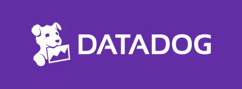

# Datadog
---

[Datadog](https://www.datadoghq.com/)

`Modern monitoring & security`

See inside any stack, any app, at any scale, anywhere.

## Sites
---
| <!-- --> | <!-- --> | <!-- --> |
| --- | --- | --- |
| [Blog](https://www.datadoghq.com/blog/) | [Documentation](https://docs.datadoghq.com/) | [Integrations](https://docs.datadoghq.com/integrations/) |
| [Pricing](https://www.datadoghq.com/pricing/) | [Free Trial](https://www.datadoghq.com/free-datadog-trial/) | [Customers](https://www.datadoghq.com/customers/) |
| [Support](https://www.datadoghq.com/support/) | [Security](https://securitylabs.datadoghq.com/) | [Privacy](https://www.datadoghq.com/privacy/) | 

## User Companies
---

- Samsung
- 21st Century Fox
- Siemens
- Whole Foods Market
- HashiCorp
- Sony
- Capgemini
- Chef
- Lufthansa Systems
- Deloitte
- Lenovo

## Products
---
| <!-- --> | <!-- --> | <!-- --> | <!-- --> |
| --- | --- | --- | --- |
| Features | Infrastructure Monitoring | Container Monitoring | NPM |
| NDM | Serverless | Log Management | Sensitive Data Scanner |
| Error Tracking | Continuous Profiler | Database Monitoring | CI Visibility |
| Service Catalog | Real User Monitoring | Synthetic Monitoring | Session Replay |
| Security Platform | CSPM | Cloud Workload Security | Cloud SIEM |
| APM | Application Security Monitoring | Dashboards | Watchdog |
| Alerts | Incident Management | Integrations | API |

## Integrations
---
- [AWS](https://docs.datadoghq.com/integrations/amazon_web_services/)
- [GCP](https://docs.datadoghq.com/integrations/google_cloud_platform/)
- [Kubernetes](https://docs.datadoghq.com/integrations/kubernetes/)
