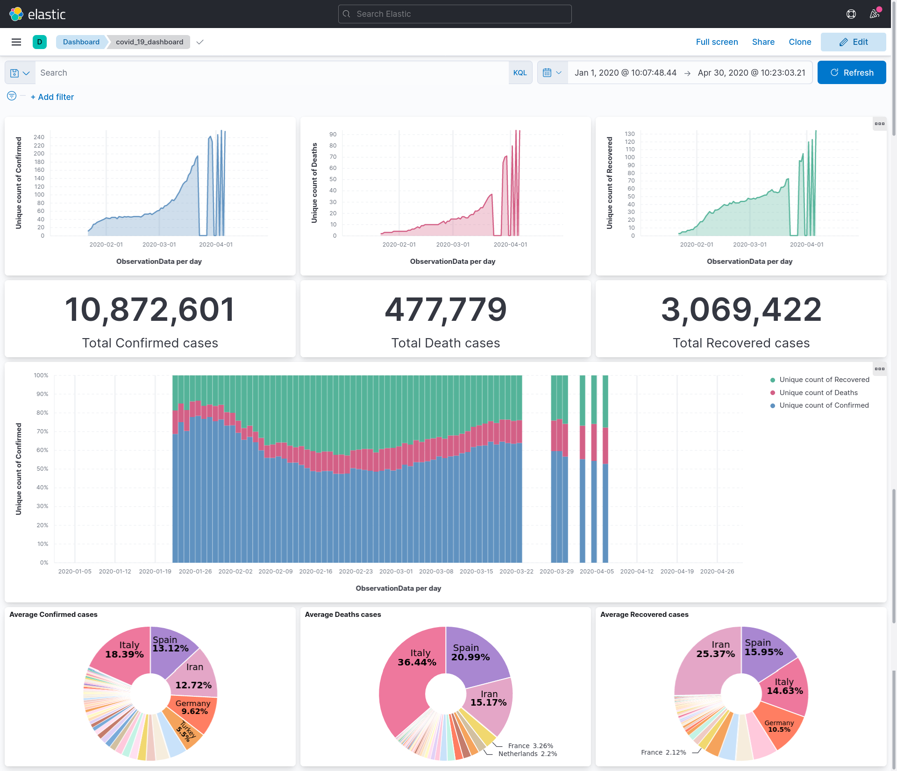

# KibanaTool
---
python3 package to create kibana dashboard using code.

First complete `Python Package Structure` steps (check below)

Then execute the command
```
python3 kibanatool/kibanacreator.py
```

`covid_19_dashboard.ndjson` will be generated in current directory.

This `ndjson` file can be imported by `Kibana` and the required dashboard will be created.



## TODO
---
- [ ] create `Makefile`
- [ ] add `.gitignore`
- [ ] testcase using pytest
- [ ] decouple main from `covid19`
- [ ] understand `__all__`

*optional*
- [ ] audit changes
- [ ] version control / changelog

## Python Package Structure 
---
#### (Optional) Create a Python environment:

For Python3 users:
```bash
pip install virtualenv
virtualenv venv_name
source path/to/venv_name activate
```
For Anaconda users:
```bash
conda create --name conda_env
conda activate conda_env
conda install pip
```

To setup the dependencies
```bash
pip3 install -e .
```
```
Obtaining file:///home/raktim/monitoring/KibanaTool
Installing collected packages: kibanatool
  Running setup.py develop for kibanatool
Successfully installed kibanatool
```

A `kibanatool.egg-info` directory should now be created in the root directory:
```
KibanaTool
|-- kibanatool.egg-info
|  |-- dependency_links.txt
|  |-- PKG_INFO
|  |-- SOURCES.txt
|  |-- top_level.txt
```

## Import / Export ndjson file
---
#### *Procedure*

- open http://localhost:5601
  - this redirects to http://localhost:5601/app/home#/
- click on `menu` on LHS
- Go to section `Management` -> `Stack Management`
  - This redirects to http://localhost:5601/app/management
- on LHS go to `Kibana` section -> `Saved Objects`
  - This redirects to http://localhost:5601/app/management/kibana/objects

#### Export ndjson file's zip
---
- select single / multiple objects
- on top right `Delete` / `Export` option will come.
- click `Export` on pop-up.
- Another way to Export all objects would be using `Export X objects` on top right.

#### Import ndjson file
---
- click on `Import` on top right.
- click on `Import` to browse through files.
- click on `Import` to confirm.
- to debug if change took place in dashboard delete the existing dashboard object beforehand on http://localhost:5601/app/dashboards#/list

## ndjson
---
`Newline-Delimited JSON`

- [JSON formatter & validator](https://jsonformatter.curiousconcept.com/#)
- [Pretty-Print Newline-Delimited JSON](https://pprint-ndjson.neverendingqs.com/)
